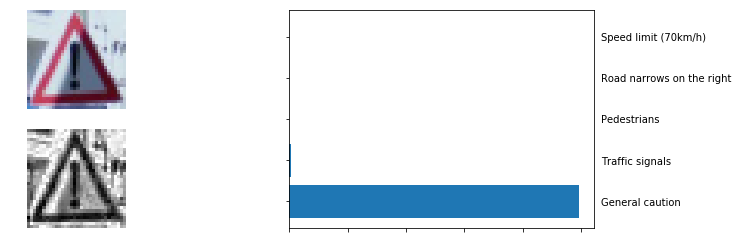
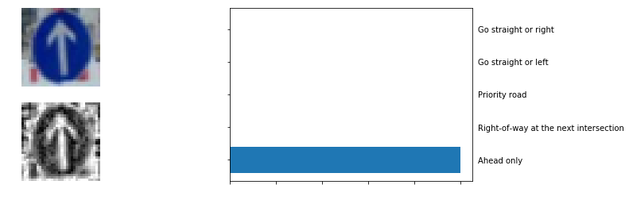
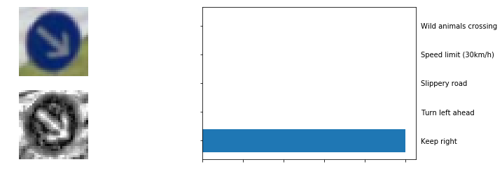
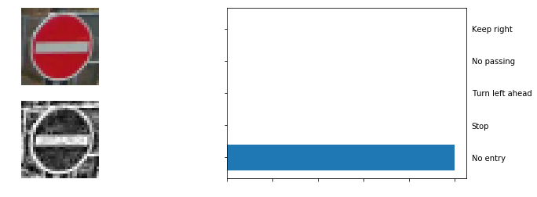
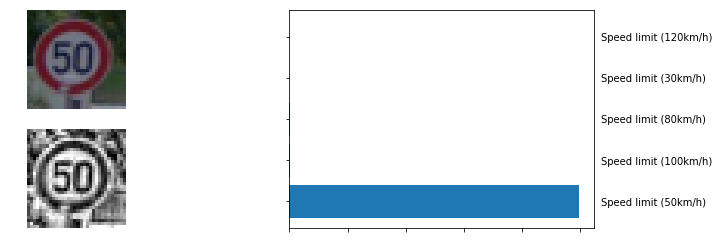
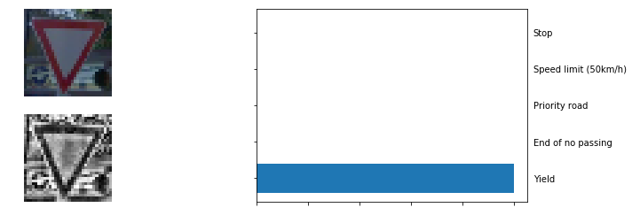

# **Traffic Sign Recognition** 

[//]: # (Image References)

[image1]: ./examples/visualization.jpg "Visualization"
[image2]: ./examples/grayscale.jpg "Grayscaling"
[image3]: ./examples/random_noise.jpg "Random Noise"
[image4]: ./examples/placeholder.png "Traffic Sign 1"
[image5]: ./examples/placeholder.png "Traffic Sign 2"
[image6]: ./examples/placeholder.png "Traffic Sign 3"
[image7]: ./examples/placeholder.png "Traffic Sign 4"
[image8]: ./examples/placeholder.png "Traffic Sign 5"
[Model]: Model.png "Model Architecture"
[sample_imgs]: ./Traffic_Sign_Classifier_md/output_16_0.png "sample imgs"

# Data

**Task of this project is classify 51839 traffic sign images to 43 classes**

**You can check sample data below**

![sample_imgs][sample_imgs]

train data: 31367 samples
valid data:  7842 samples
test data:  12630 samples

    train data: 31367 samples
    valid data: 7842 samples
    test data: 12630 samples
    Image data shape =(32, 32, 3)
    
    
    train data: 0.6050849746329984 %%
    valid data: 0.1512760662821428 %%
    test data: 0.24363895908485889 %% 
---

# Pre-process the Data Set

3-channels color is not neccesary to get high accuracy as [paper](http://yann.lecun.com/exdb/publis/pdf/sermanet-ijcnn-11.pdf) address. So, I preprocess images with grayscale and normalization through tensorflow method. To get more clear gray-scale images, I also apply 'Histogram equalization' technique. Histogram equalization is a technique for adjusting images intensities to enhance contrast.

___
# Model Architecture

![Model Architecture][Model]

> - I used 'leaky relu' as activation function rather than 'ELU' because I think it is important to consider fast model at runtime. So I didn't use 'batch-normalization' which is one of useful skills for training deep learning model.

> - I apply regulariation 'drop out' skills to both convolution layer and fully-connected layer for avoiding overfitting.

> - I concatenates tensors from previous layers before connecting to fully-connected layer to get more data representation. Before concatenating tensors, I also apply pooling to prevent model from using too much weights

> - Validation Accuracy = 0.995, I believe this model works!

> - Test Accuracy = 0.969
 
---

# New Test Image 
#### (capture from google street view)

    Correct!, Top prediction 0.9987

    Correct!, Top prediction 0.9935

    Correct!, Top prediction 0.9999

    Correct!, Top prediction 0.8149

    Correct!, Top prediction 0.9997

    Correct!, Top prediction 0.9874

    Correct!, Top prediction 1.0

    Correct!, Top prediction 0.9957

    Correct!, Top prediction 0.9986

    Correct!, Top prediction 1.0
    

---

 
 **Accuracy on 10 captured images are 100%**. Although I randomly cropped traffic signs from google street view, I think new test image is not enough to real test the performance. My model is trained on imbalanced data. It will make wrong predictions where classes we don't have enough data to train as result.

 I think it is enough to get great performance as this time.  However, I believe model make a progress with augmented data(projection, flip, projection..) and balancing data.
